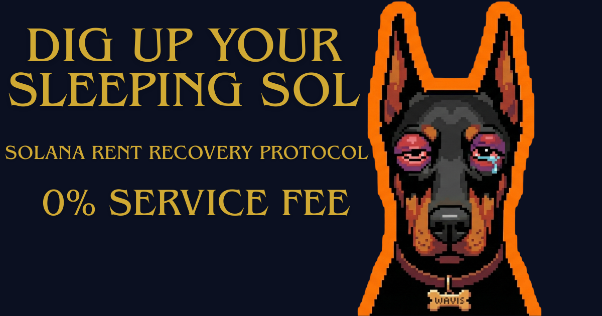

# WAVIS - Solana Rent Recovery Protocol

<div align="center">
  
</div>

<br />

**WAVIS** is a decentralized, client-side tool designed to help Solana users recover rent (SOL) from unused token accounts.
Clean your wallet, burn spam tokens, and reclaim your SOL instantly.

**[🌐 Live Demo](https://wavis.xyz)**

## ✨ Features

- **🛡️ Privacy First:** Runs 100% client-side. No data is stored on any server.
- **💸 0% Service Fee:** We take 0 fees. You only pay the Solana network gas fee.
- **⚡ Fast & Bulk Action:** Scan and close multiple accounts in one click.
- **🌍 Multilingual:** Supports English, Japanese, Vietnamese, Portuguese, and Spanish.

## 🛠️ Tech Stack

- **Framework:** [Next.js 14](https://nextjs.org/) (App Router)
- **Styling:** [Tailwind CSS](https://tailwindcss.com/)
- **Blockchain:** [Solana Web3.js](https://solana-labs.github.io/solana-web3.js/) & [Wallet Adapter](https://github.com/solana-labs/wallet-adapter)
- **Deployment:** Vercel

## 🚀 Getting Started

To run this project locally:

```bash
# 1. Clone the repository
git clone [https://github.com/YOUR_USERNAME/wavis-web.git](https://github.com/YOUR_USERNAME/wavis-web.git)

# 2. Install dependencies
npm install

# 3. Run the development server
npm run dev